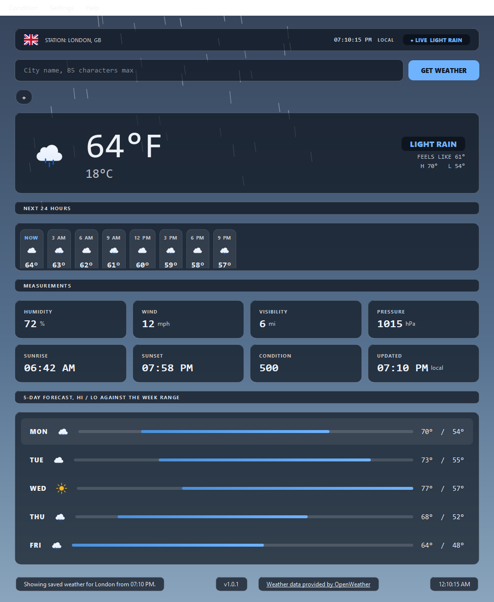
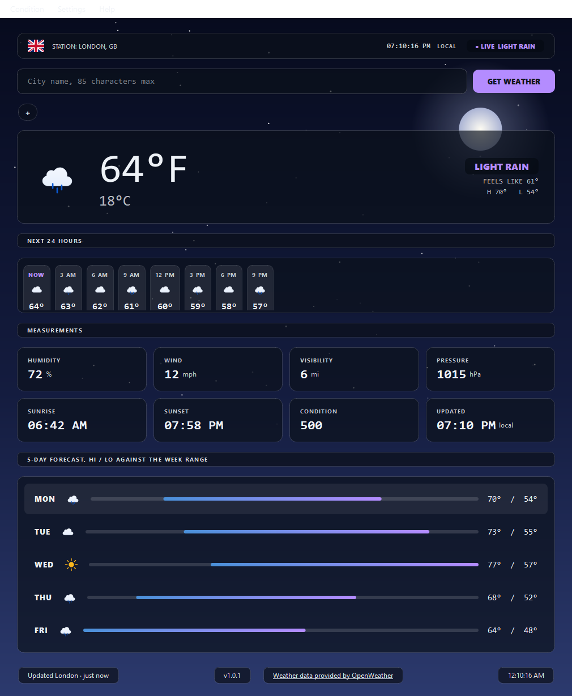

# Weather App Pro

A desktop weather application for Windows built with Python and PyQt5. It
retrieves current conditions and a 5-day forecast from the OpenWeatherMap API
and presents them with SVG icons, Lottie animations, and QSS themes.

## Features

- Search weather by city
- Current temperature in Fahrenheit and Celsius
- Hour-by-hour strip for the next 24 hours
- Saved-city favorites: click to search, plus to save the current city
  (right click removes), capped at 10 and persisted
- Search autocomplete: debounced city suggestions from the geocoding
  API while you type
- Daily hi/lo range bars for the 5-day forecast
- Live local clock for the selected city
- Country flag for the searched city
- Searches run in the background, so the window never freezes
- Automatic refresh of the last search every 10 minutes
- The last successful search is saved and shown at startup or when a
  request fails
- Imperial or metric units throughout, persisted with everything else
  (condition mode, refresh interval, window position) in settings.json
- Hand-written error messages that never expose technical detail
- Glass console design: glass panels over an animated sky that follows
  the weather, with a palette per condition (clear, cloudy, rain, snow,
  mist, night), switchable from the Condition menu

## Install

- **Installer**: download `WeatherAppPro-setup-<version>.exe` from the
  GitHub releases and run it (a license and privacy page is part of
  the wizard). No admin prompt needed for a per-user install.
- **Portable**: download `WeatherAppPro-portable.zip`, extract
  anywhere, run `WeatherAppPro.exe`.
- **From source**: follow Setup below.

You will need a free OpenWeatherMap API key
(https://openweathermap.org/appid); the app asks for it on first
start, or set it in `.env` as shown below.

## Screenshots





## Requirements

- Python 3.14 or newer
- An OpenWeatherMap API key (the free tier is enough)
- Dependencies, pinned in `requirements.txt`:
  - PyQt5 5.15.11
  - requests 2.32.5
  - python-dotenv 1.2.2
- For tests and the animation harness, pinned in `requirements-dev.txt`
  (adds PyQtWebEngine, pytest 9.1.1, pytest-cov 7.1.0, pytest-qt 4.5.0,
  requests-mock 1.12.1)

## Setup

1. Create and activate a virtual environment.
2. Install dependencies:
   ```bash
   pip install -r requirements.txt
   ```
3. Get a free API key at openweathermap.org/appid (new keys can
   take up to two hours to activate), then copy `.env.example` to
   `.env` and set your key:
   ```text
   OPENWEATHER_API_KEY=your_key_here
   ```
   Never commit `.env`. It is already listed in `.gitignore`.
4. Run the app:
   ```bash
   python main.py
   ```
5. Optional: install the dev dependencies and run the tests:
   ```bash
   pip install -r requirements-dev.txt
   python -m pytest
   ```

To test the Lottie animation pipeline on its own: `python test_lottie.py`

The app writes a rotating log to `logs/app.log` (gitignored). Set
`WEATHER_CONSOLE_LOG=1` in `.env` to also mirror log messages in the
console. The last successful search is kept in `cache.json`
(gitignored) so the app has something to show offline.

## Project Structure

```
weather-app-pro/
│
├── main.py                  Entry point, logging, crash hooks, key check
├── ui.py                    Main window: glass console layout, signals, display
├── weather_worker.py        Background search thread (QObject + signals)
├── weather_api.py           OpenWeatherMap client, validation, retries
├── weather_model.py         WeatherData and ForecastData dataclasses
├── errors.py                Exception hierarchy with safe user messages
├── logging_setup.py         Rotating file logging setup
├── crash_hooks.py           Crash logging and the final error dialog
├── cache.py                 Last successful search, saved as JSON
├── geocoding.py             City suggestions for autocomplete
├── settings.py              Persisted settings (units, geometry, interval)
├── favorites.py             Persisted saved cities (capped at 10)
├── VERSION                  App version, shown in the footer
├── config.py                App constants
├── utils.py                 Conversion helpers, redact_url
│
├── managers/                IconManager, FlagManager, ThemeManager,
│                            AnimationManager, ConditionTheme (palettes)
├── widgets/                 SkyWidget (animated background), StatTile,
│                            RangeBar, ForecastTable, HourlyStrip,
│                            FavoritesBar, LottieWidget
├── resources/               Icons, animations, lottie player, console.qss theme
├── tests/                   pytest suites (API, worker, sky, range bars, UI)
├── docs/                    Improvement plans (redesign, testing, security)
├── old/                     Legacy code, reference only
├── test_lottie.py           Manual animation test harness
├── .env.example             Template for the required environment variables
├── requirements.txt         Pinned runtime dependencies
└── requirements-dev.txt     Pinned test dependencies
```

`CONTRIBUTING.md` covers setup, tests, and the rules for changing the
code. `agent.md` holds extra working rules (including the ones for AI
agents); it is kept out of the repository on purpose.

## Planned Features

These exist as empty placeholder files already:

- Saved cities (`favorites.py`, `favorites.json`)
- Painter-based weather effects (`widgets/weather_animation.py`)
- The hourly strip from the redesign plan (optional addition to the
  console design)
- The remaining pytest suites from `docs/testing-plan.md` (the API,
  worker, and UI suites are in `tests/` already)

The improvement roadmap lives in `docs/`.

## Build

Build a portable EXE (requires Inno Setup later for the installer):

```powershell
pip install -r requirements-build.txt
powershell -File build.ps1
```

The script runs the tests, generates the icon and version resource,
builds `dist\WeatherAppPro\` with PyInstaller, scans the result for
secret material, and zips it to `release\WeatherAppPro-portable.zip`.
See `docs/release-plan.md`.

## Technologies

- Python 3.14
- PyQt5 (Widgets, Svg, WebEngine)
- requests
- python-dotenv
- OpenWeatherMap API

## License

This project is licensed under the MIT License.
